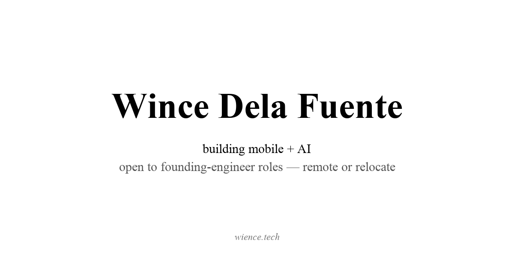

I've really wanted a place to write for a while. Not a Medium account, not a Substack, just plain essays on my own domain, the way [Paul Graham](https://paulgraham.com) does it. So I built the simplest thing that works: markdown files in a folder, a 200-line build script, and GitHub Pages.

This post exists to exercise the pipeline. Everything below is here to prove it renders.

## Images

Drop a file in `posts/images/`, reference it with a caption:



## Quotes and code

> The way to get startup ideas is not to try to think of startup ideas. It's to look for problems, preferably problems you have yourself.

Inline code like `npm run build` gets a subtle background, and blocks scroll horizontally:

```js
const posts = fs.readdirSync('posts')
    .filter((f) => f.endsWith('.md'))
    .map(parsePost)
    .sort((a, b) => b.date - a.date);
```

## Lists

- Write a markdown file
- Push to main
- That's the whole pipeline

---

If you can read this at [wience.tech/blog](https://wience.tech/blog/), it worked.
