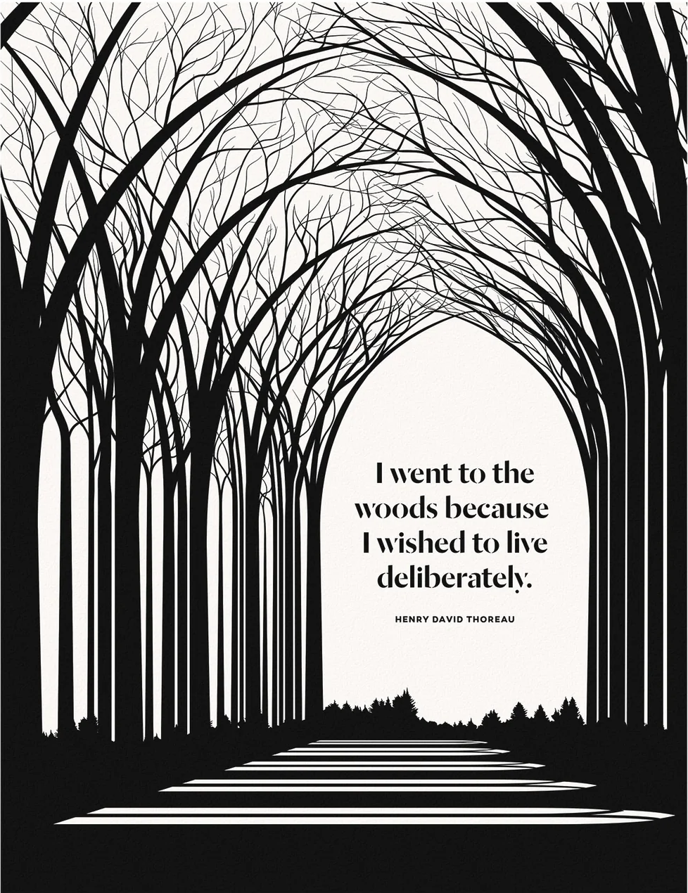

i tend to reminisce about the time before the ai era of coding, when everything felt more rewarding *~ magical ~*, even.

back in grade 11, around 2020, i somehow got into an internship with one of the hottest startups in cebu, symph. shoutout to them: https://symph.co/

and when i say somehow, i really mean it. i basically met their CTO, cold-applied, and became enough of a headache until they gave me a chance. i was still in high school, surrounded by fourth-year CS and IT students from different universities, and honestly, i had no real idea what i was getting myself into.

that internship was where i properly started learning javascript fundamentals.

i remember going through *eloquent javascript*, trying to understand functions, scopes, objects, and callbacks while also learning how to deploy an app on google cloud platform. that was how i built my first chatbot app. every now and then, i was mentored by the CTO too, which still feels crazy to think about now.

it was rough, though.

my co-interns (literal 4th year CS and IT students) did not really talk to me much for some reason, so i felt pretty isolated. i was this high school kid trying to catch up in a room where everyone else already seemed like they knew what they were doing. but in a weird way, that isolation made the whole thing feel more personal.

i remember trying to scale that chatbot app and feeling like every small thing was new. i would dig through github repos, read issues, jump between stack overflow threads, and spend hours fixing bugs that i could probably solve much faster now. but back then, every bug had a process. every fix felt like a small win. every working feature felt earned.

i think that’s the part i miss.

ai has definitely made coding easier. i use it too. i’m not pretending i code with nothing but pure logic and suffering. ai helps me move faster, organize my thoughts better, and get unstuck when i need it. and yes, i still do the thinking. i still follow the logic. i still decide what makes sense and what doesn’t.

but the feeling is different now.

before, solving a problem meant digging. searching, reading, testing, failing, retrying, and slowly building your own mental map of how things worked. now, it is very easy to skip straight to the solution. you can ask ai for the function, the fix, the explanation, the refactor, and sometimes even the thought process.

that is powerful, and honestly, there are more pros than cons.

but from a creative and emotional perspective, i feel like something has quietly been lost.

maybe it’s just nostalgia, but i miss the feeling of digging through things. i miss spending hours trying to understand why something worked. i miss writing my own function for an open-source project because the thing i needed did not exist yet (shoutout to the azeus peeps: langchain SQLDocStore — iykyk)

those moments made coding feel less like output and more like discovery.

and i think the worst part is that when i talk to some of my peers or friends about this, a lot of them cannot really relate. many of them started coding when ai was already around, or when answers had already become much easier to access. they know the convenience, but not always the before. they know the productivity, but not always the long, weird, lonely process of figuring things out from almost nothing.

so for feelings like this, i tend to look back at my grade 11 self.

a little isolated.

a little overwhelmed.

probably asking too many questions.

probably breaking things more than building them.

but also genuinely fascinated.

that version of me had no ai assistant, no instant code generation, no clean explanation waiting in another tab. just curiosity, stubbornness, a browser full of errors, and the feeling that every small thing i learned mattered.

and i miss that.

not because i want to go back to a time before ai, believe me, i don’t.

ai is amazing. but i hope we do not forget the kind of creativity that came from difficulty. the kind that came from being scrappy. the kind that came from not knowing what to do, but trying anyway.

and don’t even get me started when it comes to robotics projects.

everything used to be so much harder.

but honestly, i think that was what made it even more fun.

> *~ if you made it here, thank u for making time to read my blog, everything's a WIP, and im still pretty bad at it, but hey, the first step to being sorta good at something is being bad at it right? this is where i'll share my thoughts, feelings, and the things i'm building from now on so enjoy :> also shoutout to tushar for encouraging me to start writing ~*
